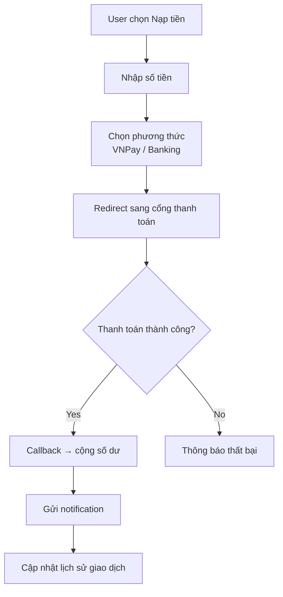
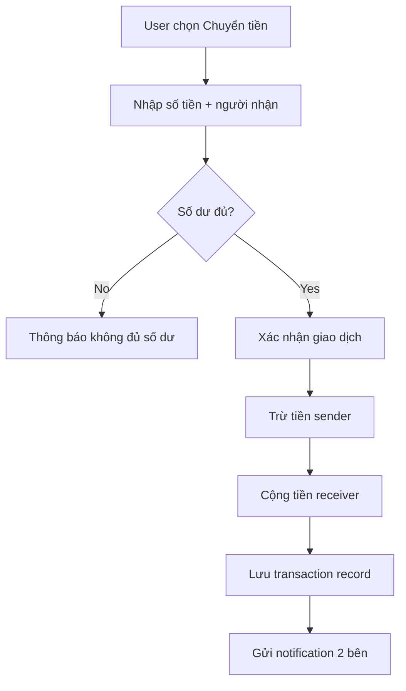

# Workflow: E-wallet

## Top Up Flow

```mermaid
flowchart TD
    A[User chọn Nạp tiền] --> B[Nhập số tiền]
    B --> C[Chọn phương thức\nVNPay / Banking]
    C --> D[Redirect sang cổng thanh toán]
    D --> E{Thanh toán thành công?}
    E -->|Yes| F[Callback → cộng số dư]
    E -->|No| G[Thông báo thất bại]
    F --> H[Gửi notification]
    H --> I[Cập nhật lịch sử giao dịch]
```

## Transfer Flow

```mermaid
flowchart TD
    A[User chọn Chuyển tiền] --> B[Nhập số tiền + người nhận]
    B --> C{Số dư đủ?}
    C -->|No| D[Thông báo không đủ số dư]
    C -->|Yes| E[Xác nhận giao dịch]
    E --> F[Trừ tiền sender]
    F --> G[Cộng tiền receiver]
    G --> H[Lưu transaction record]
    H --> I[Gửi notification 2 bên]
```