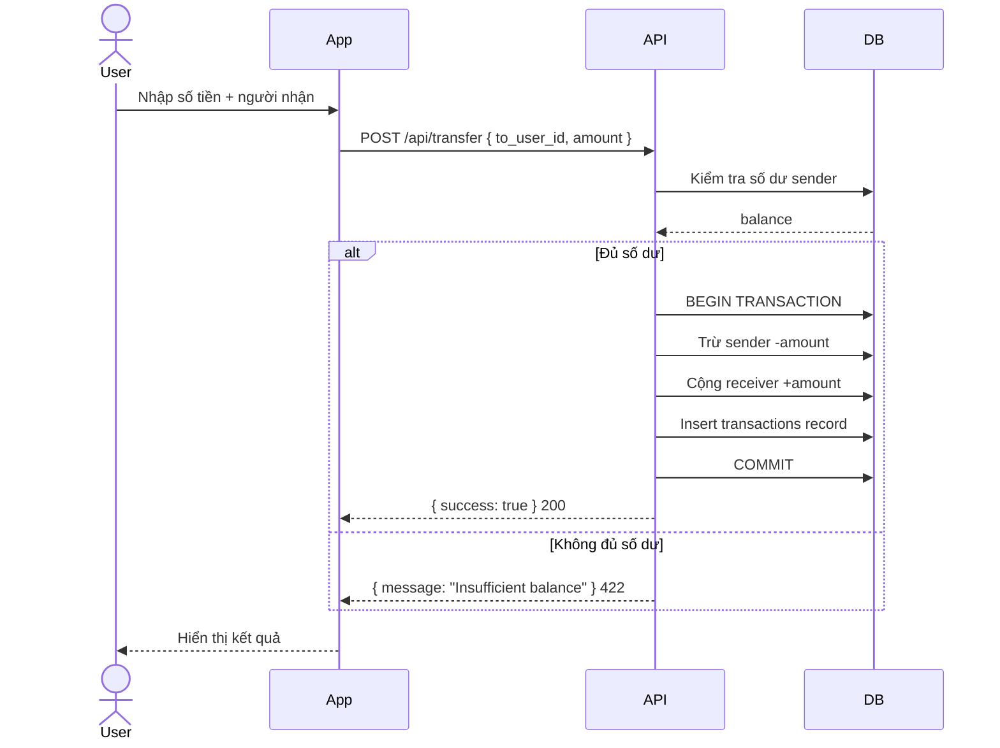

# Sequence Diagram: E-wallet

## Transfer Money

```mermaid
sequenceDiagram
    actor User
    participant App
    participant API
    participant DB

    User->>App: Nhập số tiền + người nhận
    App->>API: POST /api/transfer { to_user_id, amount }
    API->>DB: Kiểm tra số dư sender
    DB-->>API: balance

    alt Đủ số dư
        API->>DB: BEGIN TRANSACTION
        API->>DB: Trừ sender -amount
        API->>DB: Cộng receiver +amount
        API->>DB: Insert transactions record
        API->>DB: COMMIT
        API-->>App: { success: true } 200
    else Không đủ số dư
        API-->>App: { message: "Insufficient balance" } 422
    end

    App-->>User: Hiển thị kết quả
```