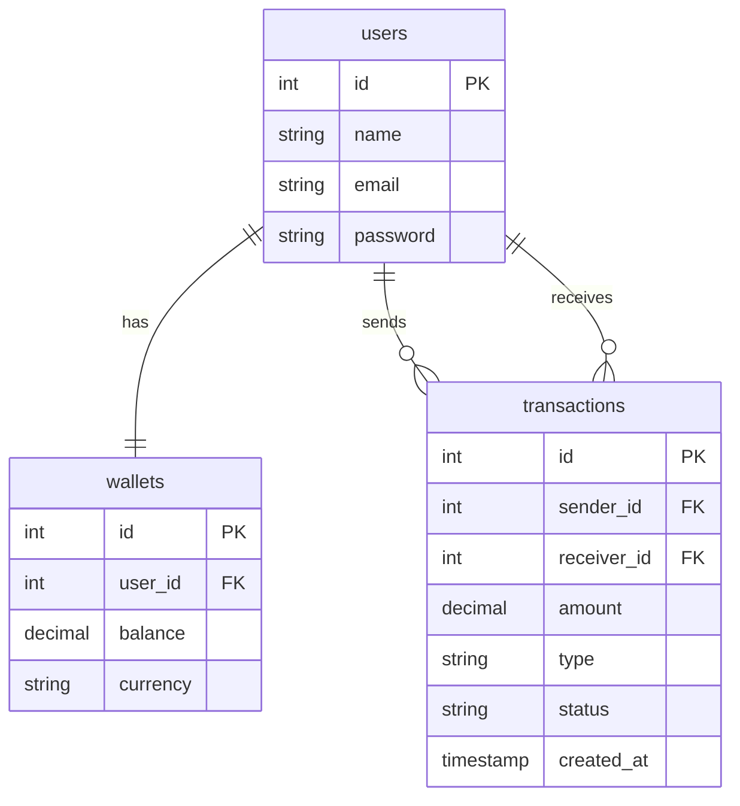

# ERD: E-wallet

```mermaid
erDiagram
    users {
        int id PK
        string name
        string email
        string password
    }
    wallets {
        int id PK
        int user_id FK
        decimal balance
        string currency
    }
    transactions {
        int id PK
        int sender_id FK
        int receiver_id FK
        decimal amount
        string type
        string status
        timestamp created_at
    }
    users ||--|| wallets : "has"
    users ||--o{ transactions : "sends"
    users ||--o{ transactions : "receives"
```